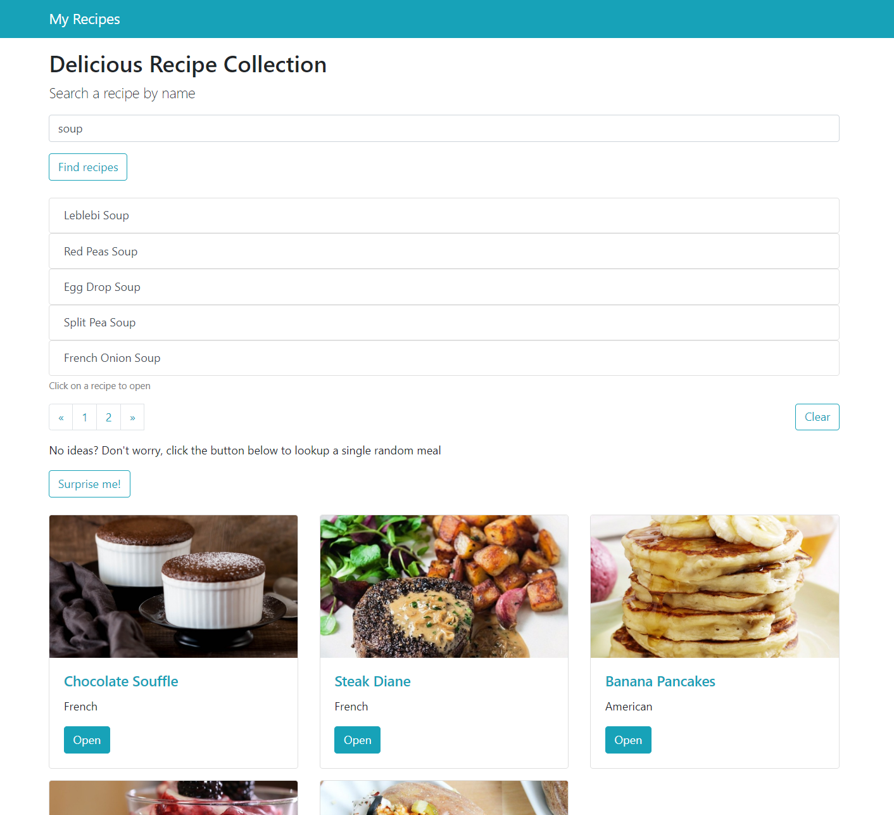
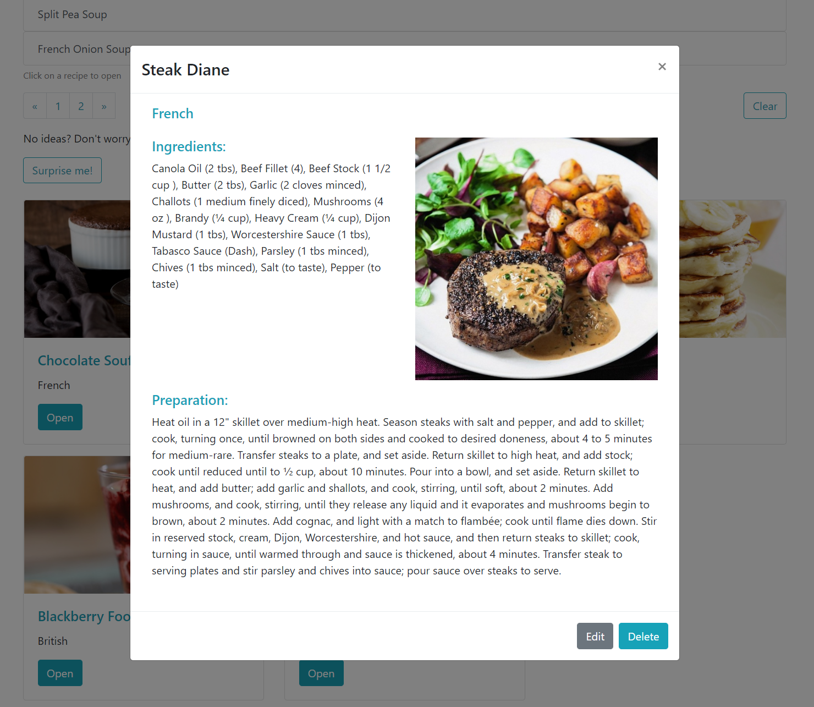

## Recipe App

A responsive, complete CRUD Web Application for browsing cooking recipes onlne, and creating a personalized collection of recipes based on the findings. A user can save preferred recipes, update and delete them.

## Code Properties

VanillaJS (no frameworks)

- custom HTTP library based on async/ await with fetch API
- pagination
- CRUD operations
- ES6 js modules

## Design

Bootstrap v4.0.0

## Babel, Webpack and Webpack-dev-server

Webpack compiler transpiles ES6+ js code down to ES5 code. It additionally supports the common js modules, whereas babel enables the use of ES6 modules. Webpack-dev-server is used to 'serve' the bundled main.js code in the browser.

## JSON Server

A full fake REST API - a quick back-end solution for prototyping and mocking.

## Installation & Setup

Install all dependencies:

```sh
$ npm install
```

Compile src code into a bundled js file:

```sh
$ npm run build
```

Start JSON Server:

```sh
$ npm run json:server
```

In another terminal, start the webpack-dev-server:

```sh
$ npm start
```

## Screenshots





## Links

[Webpack](https://webpack.js.org/)

[Babel](https://babeljs.io/)

[JSON_server](https://github.com/typicode/json-server)

[TheMealDB](https://www.themealdb.com/api.php)

[Bootstrap](https://getbootstrap.com/)
